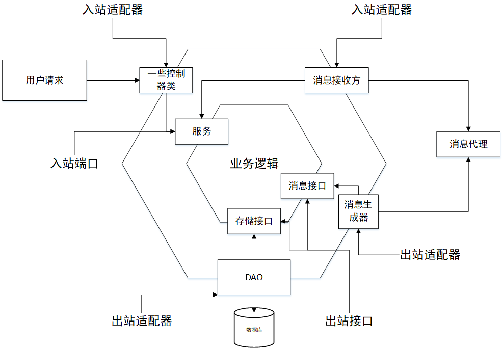

# qdu-together-userdomain

这是老傅的小程序用户领域 *纯后端* **（附赠WEB调用Demo）**

---

## 后台框架

工具使用：Spring boot+Spring Framework+Mybatis+RabbitMQ  
依赖项配置：配置[application.properties](src/main/resources/application.properties)  其余配置通过Java Annotation来实现

基本思想：DDD（*Domain-Driven-Design*）**[Eric Evans]**
> · 通过 spring-mybatis 工具来进行 Spring 与 Mybatis 整合  
· 通过 spring-amqp 工具来进行 Spring与 RabbitMQ 整合  
· Respository 是对 Mybatis工 具集的抽象与二次封装，并实现简单的 LRU  
· RabbitMQ 作为对外适配器，并由Core进行服务Route  
· Core 通过 AOP 对服务请求进行响应  
· 领域对象为 Entity ，通过访问 Entity 根完成简单的领域服务  

架构风格：独立构件与调用返回  
架构选择：层次架构（**六边形架构**）与微内核架构  
层次调用顺序：业务逻辑层⇋领域服务层⇋领域实体  
微内核提供基础服务与系统管理  

  

### 后台框架解释  

整体框架包含着：核心、Repository 模式、RPC、IOC、AOP 以及 AMQP 支持。  

核心：在DomainCore中实现类扫描与AOP，通过注解的方式来进行流程管理。  

Repository： 通过使用 ORM 等工具来链接数据库，并对数据进行管理。  

AMQP 模块：对 Spring-amqp 进行封装。  

IOC：在对原本 Spring-framework 的支持的基础上对框架特定的工具支持控制反转功能和依赖注入，通过注解来进行控制反转过程。  

AOP： 提供自定义 AOP 与 JDK 代理的 AOP 方式。  

RPC： 提供自定义的 RPC 客户端与服务端的构建与使用方法，通过注解告知需要注入的注册函数。  

> 样例代码在于 [Demo](/demo) 目录下与 [userdomain](src/main/java/qdu/together/userdomain) 中

---  

## 特别感谢  

关于 .NET Core 端框架在此：[c#实现领域驱动](https://github.com/tiger5331819/PointCloudCore-DDD)  

框架的编写是我大学期间最想做的一件事情，也是我大学期间的一个阶段性的结束，通过编写框架，从而让我眼界大开，增长见识。我想成为一名系统架构设计师，这是我踏上这条道路的第一个脚印，千里之行始于足下。  

要感谢我的家人，是他们在我的背后默默的给予我前进的动力，感谢我的爱人，她是我航行路上温暖的避风港，感谢我的好伙伴，是他的设想给予了我前进的方向。  

最后还要感谢刘晓云老师孜孜不倦的指导，正是老师的支持和教诲，能够让我坚持并最终完成整个框架的设计与编写。  

如果对框架有不理解的，需要我补充的，欢迎联系我，我们一起探讨，共同进步~~~  

·QQ: 563954901  
·微信： shy563954901  
·电话： 17853241669  
·E-mail： tiger5331819@163.com  

## 更新说明与日志  

格式说明：

1. **Version** 为版本号
2. *Update* 为更新日期与当天更新版本号  
3. ***正文*** 为更新内容

### Vesion 0.5  

Update 2020.3.7  
version 1  
·新增RPC：  

增加了RPC客户端和RPC服务端，通过注解和注册来进行远程函数注册，利用json可以跨语言调用。  

#### 代码示例  

##### 通过注解标注注册RPC调用类和调用函数  

```@RPC``` 用于标注此类是否为RPC调用类，使用了该注解```@PRCMethod```才会生效  

```@PRCMethod``` 用于标注RPC服务端调用的具体函数，```MethodName``` 用于标注RPC服务端调用函数的函数名  

```Java
@RPC
public class RPCTest{
    @RPCMethod(MethodName = "Test")
    public Param2 Add(String a ,String b){
        return new Param2(a+b);
    }
}
```  

service注册的是被```@RPC```标注的类，以及提供一个对外搜索的名字

```Java
RPCService service = new RPCService(9010);//创建RPC服务端并绑定端口
service.register("RPCTest", RPCTest.class);//注册RPC调用类
service.start();//启动
```  

使用RPC客户端的时候必须遵循规则：  

1. Java函数需要标明注册的类名称  

2. 需要注明需要调用函数的参数名称  

3. 需要有准确的参数  

4. 需要标明返回结果的类型  

```Java
RPCClient Client=new RPCClient(new InetSocketAddress("localhost",9010));//创建RPC客户端并连接  
Param2  obj= (Param2)Client.JavaRemoteProxy("RPCTest", "Test", new Object[]{new Param("苏琥元","100")}, Param2.class);//调用远程函数并传入对应参数
```  

### Vesion 0.4  

Update：2019.12.30  
version 1  
· 核心名字正式更名  
· 核心优化：  

1. 增加了类加载模块与核心AOP解析模块，现已经可以通过对框架注解标注的类进行解析并自动装载。  

2. 增加了可自定义AOP的模块与JDK代理模块，现已经可以通过使用模块来快速构建AOP方法增强。  

3. 增加了自定义注解的解析功能，现已经可以通过核心来获得自定义类注解标注的类的反射。  

4. 优化了框架方法的调用编程难度，现已经不需要继承接口，通过注解的方式来装载方法，并且支持自定义方法注解，前提是需要有注入框架中的对应AOP增强类，如下所示：  

#### 代码示例  

##### 通过注解装载方法  

```Java
@DomainService(ServiceName = "ServiceExample")
public class ServiceExample{

    @ServiceDo
    public void doService(Message message) {
        ..............
    }

    @myannotation
    public void dome(Message message){
        ..............
    }
}  
```

##### 自定义AOP  

如果需要添加到框架中则需要```@DomainAOP```与```@Type```进行标注，如下所示：  

```Java
@DomainAOP(DomainAOPName = "myaop")
@Type(TypeMessage = TypeMessage.Message)
public class myaop extends AOP {

    public myaop(..........) {
        super(myannotation.class);
    }

    ................
}
```

如果不需要添加到框架中则不需要注解进行标注，并建议使用JDKproxy模块：

```Java
public class myaop extends JDKproxy{
    ............
}
```

并通过此方法来创建JDK代理

```Java
public Object createProxy(Object aopMethod);
```

##### 自定义方法调用**(必须有自定义的AOP添加到框架中)**  

```Java
@Target(ElementType.METHOD)
@Retention(RetentionPolicy.RUNTIME)
@Documented
public @interface myannotation{
}
```

##### 源码解析  

通过```@DomainAOP(DomainAOPName="AOPName")``` 标注的AOP来寻找到被自定义注解标注的方法  

```Java
for (Annotation annotation : method.getAnnotations()) {
    if (annotation.annotationType().getSimpleName().equals(classDo.getSimpleName())){
        ...............
        method.invoke(clazz.newInstance(), object);
        ...............
    }
```

核心AOP模块通过```@DomainAOP```的AOP类来对```@Type```标注的类型进行不同的消息传递处理。

```Java
for (Annotation annotation : clazz.getAnnotations()) {
    if (annotation.annotationType().getSimpleName().equals("Type")) {
        ..............
    }
```

PS： 所有的AOP模块都提供了默认的prepare与finsh这两个切面，如果需要多个切面或者别的增强方式，需要自己与prepare()与finsh()方法中进行定义，如果对AOP功能有着更多的需求，需要使用与spring整合的AspectJ框架。  

### Vesion 0.3

Update：2019.12.4
Version 1
· 在DomainCore中增加线程池ThreadPoolExecutor来进行多线程编程  
· 增加AMQPCore用于对消息队列的控制和结果的Route（用于上游）  
因此在监听函数中新的方法如下：  

``` Java
@RabbitListener(queues = "QueueName")
public void getMessage(Message message){
    AMQPCore.getInstance().setMessage(message);
}
```

主函数中有了对AMQP新的配置方法：  

```Java
public static void main(String[] args) throws Exception {
    SpringApplication.run(DemoApplication.class, args);
    AMQPCore.getInstance().Configuration("QueueName", "ClassPackageName");
}
```

因此就可以在Controller中通过结果队列来获得特定的结果：  

```Java
 Message result = AMQPCore.getInstance().getResult("ResultQueueName");
```

ResultQueueName从注解@ResultQueue中获得，注解使用方法：  

```Java
@RestController()
@ResultQueue("ResultQueueName")
```

### Vesion 0.2

Update：2019.12.2  
Version 1  
· 为核心增加包扫描功能并且增加@DomainService与@DomainRepository注解  
· DomainCore现在可以通过扫描注解来自动配置增加了@DomainRepository注解的Repository与自动路由增加了@DomainService注解的NetService  

```Java
@DomainService(ServiceName = "ServiceName")
public class ServiceExample implements NetService {

    @Override
    public void doService(Message message) {
    .........
    }
}
```

```Java
@DomainRepository(RepositoryName = "RepositoryName")
public class TypeRepository extends Repository<EntityIdentity,Entity> implements RepositoryAccess{
            ...............
}
```

· 同样的也可通过自定义编写接口UserNetService来继承NetService从而不再需要自动获取Core  
例如这样  

``` Java
public interface UserNetService extends NetService{
    public UserDomainCore core=UserDomainCore.getInstance();
}
```

非常建议使用依赖倒置的方法来访问Repository，即使用RepositoryAccess  

```Java
RepositoryAccess res= (RepositoryType) core.getRepository("RepositoryName");
```

当然也可以不使用RespositoryAccess来访问，毕竟Respository都需要继承RespositoryAccess接口  

```Java
UserRepository res= (RepositoryType) core.getRepository("RepositoryName");
```

· 还有一点忘了说明了，关于Core的启动方式也迎来了新的改变  

```Java
UserDomainCore.getInstance().run(SpringApplication.run(Application.class, args));
```

· 关于Message等的小改动这个直接看代码就知道了这里就不再做赘述。  
这次DomainCore增加了简单的IOC功能（*Core容器*），日后有需要的话可以做拓展。（*这感觉非常的cooooooooooooooool*）  

### Vesion 0.1

Update：2019.11.30  
Version 1  
· 新增启动DEMO以及部分优化  
· DEMO为单独的spirngMVC项目，用来展示Controller如何通过RabbitMQ来连接后端框架  
